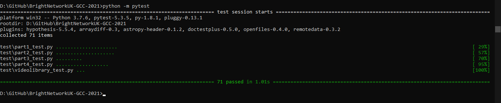

# BrightNetworkUK-GCC-2021
This repo is related to Google Coding Challenge, given to Bright Network Internship Experience 2021. Language used here is python.

## Requirements:
- Python 3.7 or higher
- Pytest (to install: pip install pytest)
- IDE (e.g VS code etc)

## How to run:
- Download the project
- set CMD/terminal address to project dictionary (cd PROJECT_PATH)
- And run Command: python -m pytest

## All Test Pass - Screenshot:

